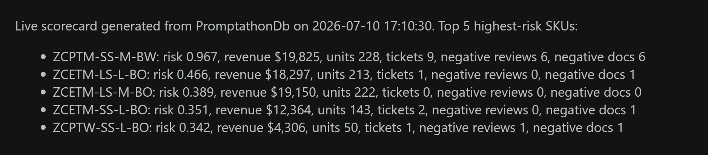

# VoC Risk Scorecard 📊

**A trust-audited, rerunnable Voice-of-Customer intelligence mart — built live against SQL Server vector search for the [Microsoft SQL AI Promptathon](https://github.com/microsoft/sql-ai-promptathon) (July 2026).**

> **Business question:** Which product is quietly accumulating the most customer dissatisfaction across reviews, chats, and support tickets — and how much confidence should leadership place in that signal?

📄 [Original competition submission](https://github.com/microsoft/sql-ai-promptathon/issues/18) · 👩‍💻 Built with GitHub Copilot (agent mode) executing live SQL MCP calls, with Claude as planner/reviewer

## The one-line thesis

Most AI demos *use* vector search. This project **audits** it — hand-labelling semantic matches to measure precision and recall before letting them inform a business decision. The most valuable findings were the failure modes.

## What it does

A rerunnable Jupyter notebook connects live to a SQL Server database (reviews, support chats, tickets, sales) and on every run recomputes a **per-SKU support-risk scorecard** — combining revenue, complaint volume, satisfaction, and negative-document signals into one transparent, documented score. No hardcoded results, no black box: the score is a min-max normalised weighted sum anyone can inspect and re-weight.

The project deliberately spans all three data roles:

- **Data engineering** — assemble reviews, support chats, tickets, and sales into one clean per-SKU view (including parsing ratings and languages packed as `"key:value"` strings inside a JSON tags column)
- **Data science** — use SQL Server vector similarity (`find_similar_docs_by_doc_id` over precomputed embeddings) to surface recurring complaint themes across a multilingual corpus (EN/ES/FR)
- **Data analysis** — turn it into a ranked, decision-ready scorecard with an executive summary

## What the trust audit found

This is the part I'd want you to read. Rather than trusting vector similarity, I measured it — hand-labelling retrieved neighbours as true/partial/false to compute **precision**, then reading the full 89-document corpus to establish ground truth and compute **recall**. Three findings:

**1. Similarity tracks topic, not sentiment.** A 5-star delighted review sat at cosine distance 0.32 from a 1-star complaint about the same product — a false positive a naive pipeline would count as a complaint.

**2. Single-seed retrieval is blind to what it wasn't seeded with.** Seeding from one complaint theme (premium-quality) recovered 3/7 of its own documents and **0/6** of a second, entirely distinct defect cluster (a smart-fabric top losing app connectivity after washing). Recall 0.00 — the exact failure mode an unaudited embedding search hides.

**3. Two independent methods converged.** The aggregation-based risk scorecard and the embedding-based theme audit were built separately — and both flagged the same SKU (`ZCPTM-SS-M-BW`: risk score 0.97 vs 0.47 for the runner-up; 9 attributable tickets vs 1–3 for peers; 14 negative documents across three languages). Convergence of independent methods is a far stronger result than either alone.

## Repository contents

| File | What it is |
|---|---|
| [`voc_risk_scorecard.ipynb`](voc_risk_scorecard.ipynb) | The rerunnable pipeline — live DB connection, parameterised thresholds and weights, per-SKU aggregation, transparent scoring, exec summary, and a vector-search evidence layer |
| [`data/zava_docs_labelled.xlsx`](data/zava_docs_labelled.xlsx) | The hand-labelled 89-document corpus used as ground truth for the precision/recall audit |
| [`docs/prompt-journey.md`](docs/prompt-journey.md) | The five-step prompt log: how the agent was directed, what each step returned, and what went wrong |
| `assets/` | Screenshots of live tool calls and the final scorecard |

## How it was built

GitHub Copilot Chat in agent mode executed all live SQL MCP calls and built the notebook; Claude was used separately to plan the approach, write the prompts, and review results. The prompts (full log in [`docs/prompt-journey.md`](docs/prompt-journey.md)) followed a deliberate discipline:

- **Force live data, forbid fallbacks** — every prompt required proof that results came from live SQL MCP calls, not repo documentation, and demanded "say exactly what failed" instead of silently substituting files
- **Show your work** — exact tool call + raw result after every step
- **Keep human judgment human** — the agent built the hand-labelling table but was explicitly forbidden from judging similarity itself
- **Feed learned gotchas forward** — plural entity names, `aggregate_records` needing a `groupby`, `TagsJson` being an array of `"key:value"` strings, cosine distance lower=closer, nullable SKUs

One instructive bug: the MCP `read_records` tool silently paginates at 100 rows, which undercounted sales totals in step 4 (210 units / \$18,265). The final notebook uses a direct database connection with no row cap and corrected the figures (228 units / \$19,825) — a live lesson in verifying tool limits before trusting tool output.

## Honest limitations

- The corpus is small (89 docs, ~47 tickets), so results are directional, not definitive
- Revenue is weighted into the risk score as an impact multiplier — a high-selling, complaint-free product can still rank on sales alone
- Support-chat complaint detection is conservative (chats contributed 0 negative docs)
- Roughly a third of tickets carry no SKU and can't be attributed

## About

Built by [Tatiana Patrusheva](https://ailinnesse.github.io) ([LinkedIn](https://www.linkedin.com/in/tatiana-patrusheva/)). See also [Subreddit Pulse](https://github.com/ailinnesse/subreddit-pulse) — an agentic AI app applying the same philosophy: retrieval quality and grounding over model size.

*July 2026*
