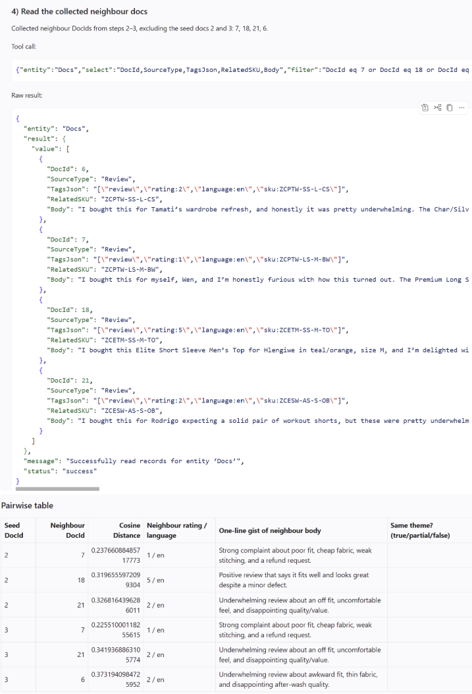
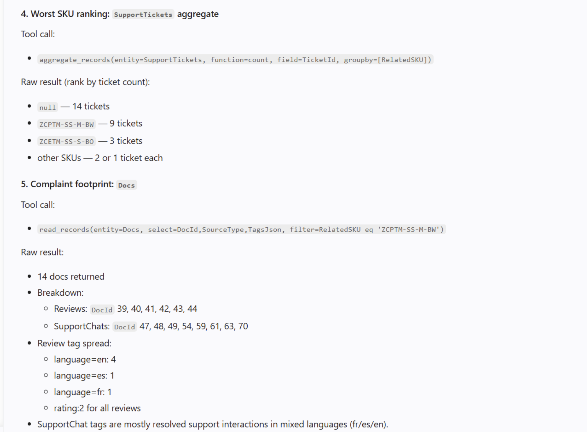

# Prompt journey: directing the agent, step by step

This is the working log behind the [VoC Risk Scorecard](../README.md) — five prompts to GitHub Copilot Chat (agent mode, live SQL MCP tools against PromptathonDb), each with what came back and what it taught. The full original log with screenshots is in the [competition submission](https://github.com/microsoft/sql-ai-promptathon/issues/18).

**Harness:** GitHub Copilot Chat agent mode, automatic model selection (mostly MAI-Code-1-Flash; step 4 on Raptor mini). Claude (Opus 4.8) was used separately for planning, prompt-writing, and review — Copilot did the execution.

---

## Step 1 — Verify the tools before trusting them

**Goal:** Prove every result comes from live SQL MCP calls, not repo documentation.

**Prompt discipline:** Explicitly forbid answering from `SQL_DATABASE.md` or config files ("if you find yourself reading a repo file, stop"), require the exact tool call and raw result after every step, and require a plain statement per step: live call or file?

**Outcome:** ✅ All four calls ran live — schema discovery (`describe_entities`, 9 entities), ticket aggregation by category/priority, sample review reads, and a first vector search. Two server quirks surfaced immediately and were fed forward into every later prompt: entity names must be **plural** (`SupportTickets`, not `SupportTicket`) and `aggregate_records` **requires** a `groupby`. Also surfaced the key caveat early: the data is tiny (~47 tickets), so everything is directional.

## Step 2 — Seed a theme, and set up the audit

**Goal:** Seed a "premium quality complaint" theme from two 1-star reviews and retrieve their semantic neighbours — then prepare to judge the retrieval rather than trust it.

**Prompt discipline:** The agent builds the (seed, neighbour) table with distances, ratings, languages, and one-line gists — but the "Same theme? (true/partial/false)" column is left **empty for hand-labelling**. The agent was explicitly told not to judge similarity itself.

**Outcome:** ✅ The "messy" result was the point: of the retrieved neighbourhood, one true match, two partial (milder 2-star reviews), and one clean false positive — a 5-star delighted review of the same SKU at cosine distance 0.32. Live proof that **similarity tracks topic, not sentiment**.

The raw `read_records` output and the assembled hand-labelling table, exactly as returned:

## Step 3 — Read everything, to know what retrieval missed

**Goal:** Pull the entire Docs corpus as CSV (parsing rating/language out of `TagsJson`) for full hand-labelling — establishing ground truth for recall, not just precision.

**Outcome:** ✅ And it corrected an assumption: the corpus is 89 docs, not the ~83 assumed. Reading everything exposed a **second complaint theme the seeds never surfaced** — a smart-fabric top losing app connectivity after washing (6 reviews across EN/ES/FR). Hand-labelling gave the recall reference: seeding from theme one recovered 3/7 of its own docs and **0/6 of theme two**. Single-seed retrieval is structurally blind to what it wasn't seeded with.

## Step 4 — Quantify the business impact

**Goal:** Having found the connectivity cluster by reading (not by retrieval), confirm retrieval recovers it when seeded from inside, then quantify the SKU: sales footprint, support burden, complaint footprint, and rank against all SKUs.

**Outcome:** ✅ Retrieval seeded from inside the cluster recovered it cleanly (DocId 39 → 44, 42, 40, 41). The SKU is the most-complained-about identifiable product: 9 tickets vs 1–3 for peers, uniformly low satisfaction, 14 negative docs in three languages.

 **One data caveat discovered later:** `read_records` silently paginates at 100 rows, so the sales totals from this step (210 units / $18,265) were undercounted; the step-5 notebook's direct connection corrected them (228 units / $19,825). Verify tool limits before trusting tool output.

## Step 5 — Make it rerunnable

**Goal:** A notebook that regenerates the scorecard from live data on every run — parameterised thresholds and weights, no hardcoded results, transparent scoring.

**Prompt discipline:** Specify the pipeline exactly (what to pull, how to parse `TagsJson`, why to sum `LineTotal` and not `SalesOrders.TotalAmount` — double-counting), list every learned gotcha, and require a working smoke test before building anything.

**Outcome:** ✅ The strongest step. After ODBC troubleshooting, the agent found a working live path (direct `pymssql` to the DB container), proved it (89 docs), and built + ran the scorecard end to end. `ZCPTM-SS-M-BW` topped it at **0.97 vs 0.47** for the next SKU — the aggregation method independently converging on the product the semantic audit flagged. Known limitations are documented in the [README](../README.md#honest-limitations).

---

## What transfers beyond this competition

1. **Audit retrieval before it informs decisions** — measure precision by labelling neighbours, and recall by establishing ground truth independently of the retrieval system.
2. **Make agents show provenance** — "exact tool call + raw result" catches silent fallbacks and silent pagination.
3. **Keep the judgment call human** — agents assemble evidence tables; humans fill in the verdict column.
4. **Cross-check with an independent method** — two roads to the same SKU is worth more than one confident answer.
